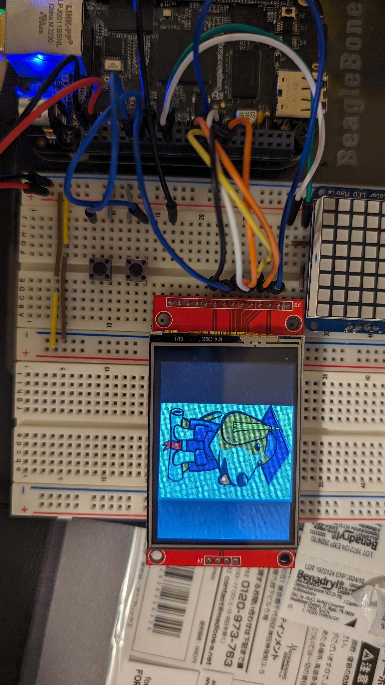
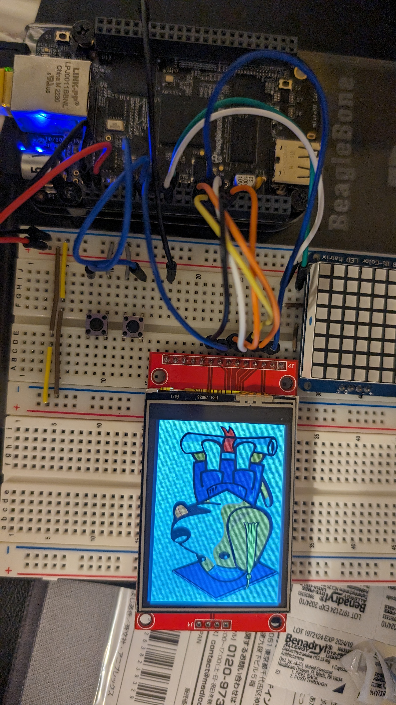
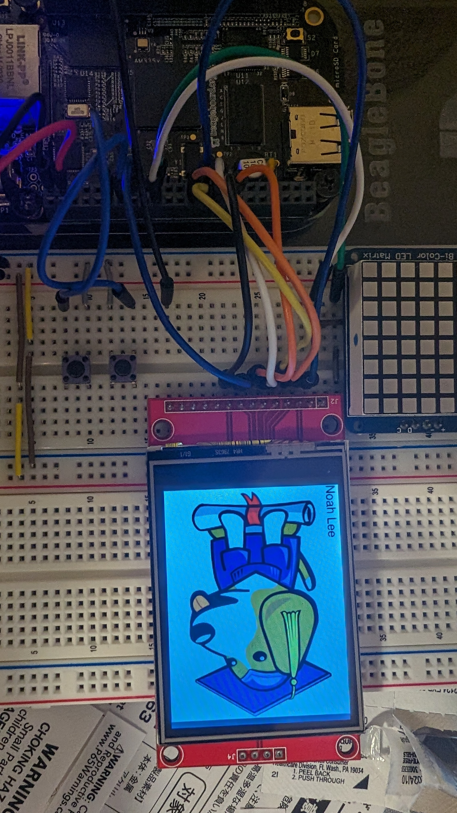

# Homework 4
## Memory Map
## mmap setup
| Purpose      | GPIO PIN | GPIO1 OFFSET|
| ----------- | ----------| --- |
| Button0     | P9_11     | 1<<30 |
| Button1     | P9_13     | 1<<31 |
## mmap gpio toggle
I tried toggling the gpio without any sleep functions on oscilliscope to see what would happen \
I got the result of 140.9kHZ frequency. Compared to the maximum speed of 2.724kHZ for the .c gpiod toggling, mmap is much much faster.

## mmap led
This program simply toggles on and off the USR2 and USR3 built-in LEDS using button0 and button1.
You may need to disable USR2 and USR3 from its status led utilities to get this to work properly.

## Kernel Driver
## Flask + Etch-a-Sketch
This maintains the use of the tmp101 sensors for clear and toggling color, but even these functionalities are also done using the web interface. \

After running 
` chmod +x etch_flask.py ` in hw04/etch \
This program is simply run using ` ./etch_flask.py` and going to http://192.168.7.2:8081/ \

Credits go to Google Bard for making this look pretty after I got the basic functionality working.

## LCD Display
The LCD is connected through SPI1
### Boris Photo
To display the regular boris.png \

run ` sudo fbi -noverbose -T 1 -a boris.png `
To rotate the image, I chose to modify the image instead of interfacing with fbi directly \

This was done using ` convert boris.png -rotate 90 borisRotate.png ` \
and displays with ` sudo fbi -noverbose -T 1 -a borisRotate.png ` \ 
### mplayer Playback
To play gif format looping 5 times \

https://github.com/Navelwriter/ECE434-leeni/assets/77686570/cf67ba09-686c-456a-bb42-c3a6f238b041

run ` mplayer -loop 5 -vo fbdev2:/dev/fb0 -vf scale=320:240 -framedrop girl.gif `

To play gif rotated 90 degrees (without looping)

https://github.com/Navelwriter/ECE434-leeni/assets/77686570/8bfd5f7d-5d36-42a2-83e7-c4d8211cede3

run ' mplayer -vo fbdev2:/dev/fb0 -vf rotate=1 -vf-add scale=320:240 -framedrop girl.gif `
### Generate Text
Simply run ` ./text.sh `

###
