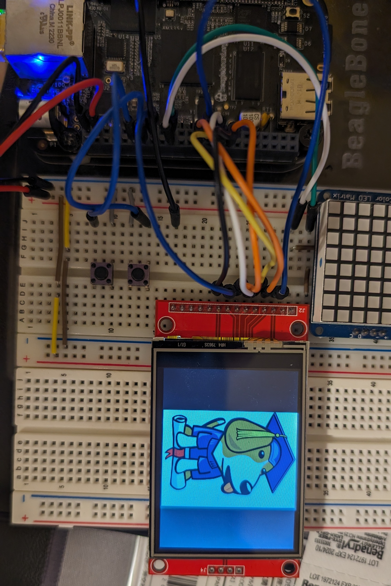

# Homework 4
## Memory Map
## mmap setup
| Purpose      | GPIO PIN | GPIO1 OFFSET|
| ----------- | ----------| --- |
| Button0     | P9_11     | 1<<30 |
| Button1     | P9_13     | 1<<31 |
## Kernel Driver
## Flask + Etch-a-Sketch
## LCD Display
The LCD is connected through SPI1
### Boris Photo
To display the regular boris.png \

run ` sudo fbi -noverbose -T 1 -a boris.png `
To rotate the image, I chose to modify the image instead of interfacing with fbi directly \

This was done using ` convert boris.png -rotate 90 borisRotate.png ` \
and displays with ` sudo fbi -noverbose -T 1 -a borisRotate.png ` \ 
### mplayer Playback
To play gif format looping 5 times \

https://github.com/Navelwriter/ECE434-leeni/assets/77686570/cf67ba09-686c-456a-bb42-c3a6f238b041

run ` mplayer -loop 5 -vo fbdev2:/dev/fb0 -vf scale=320:240 -framedrop girl.gif `

To play gif rotated 90 degrees (without looping)

https://github.com/Navelwriter/ECE434-leeni/assets/77686570/8bfd5f7d-5d36-42a2-83e7-c4d8211cede3

run ' mplayer -vo fbdev2:/dev/fb0 -vf rotate=1 -vf-add scale=320:240 -framedrop girl.gif `
### Generate Text
Simply run ` ./text.sh `

###
