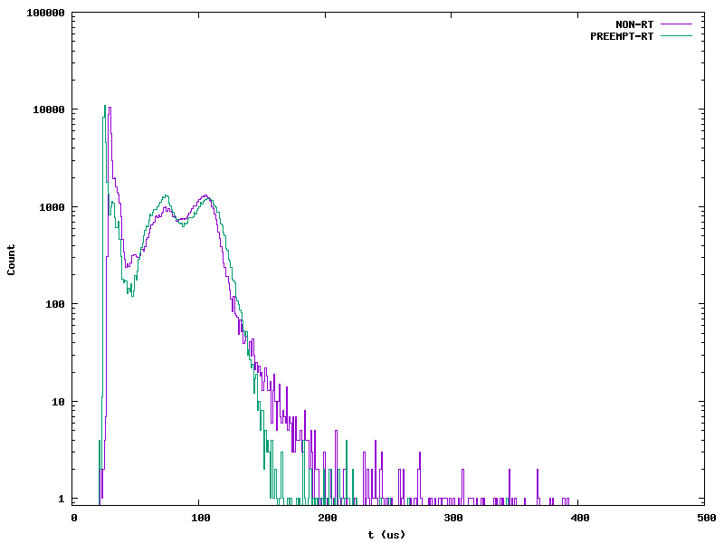
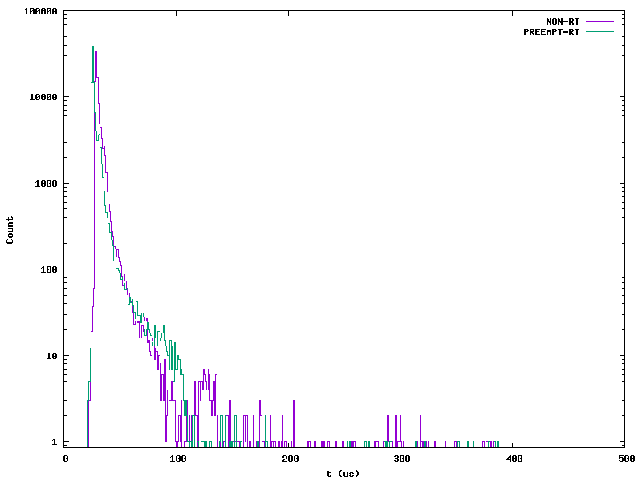

# Homework 6
## Watch
#### 1. Where does Julia Cartwright work? 
Julia works at National Instruments.
#### 2. What is PREEMT_RT? Hint: Google it.
PREEMT_RT patches Linux to operate as a real-time system. This allows for quicker response times and operation, and allows for the CPU to be interrupted in the middle of running kernel code for example.
#### 3. What is mixed criticality?
This is an embedded system that has characteristics of both RTOS and that of more traditional OS's. Using a shared scheduler, one is able to share the kernal and classify each process as RT tasks or Non-RT tasks.This can even allow for both types of processes to communicate with each other. 
#### 4. How can drivers misbehave?
As drivers are shared on the same driver stack, this can make drivers misbehave. Especially if the drivers are interrupted, preventing threading during this.
#### 5. What is Δ in Figure 1?
The delta stands for latency, key for real-time guarantees. Shows the time it takes for the real-time task to execute, must have a defined limit to allow for better scheduling. 
#### 6. What is Cyclictest[2]?
This measures the time between two points of interest. A timestamp is taken at the start, it sleeps for a specified period of time, and starts a new thread where the second timestamp is made. It tracks the time between when a thread is supposed to start vs what the actual time is. 
#### 7. What is plotted in Figure 2?
Figure 2 shows the histogram of Cyclictest with two different versions of linux. preemt is without the RT patch to linux and PREEMT_RT is with the patch, represented as purple and green respectivly. This is just to compare the different timings, with PREEMPT_RT having more consistent timings. 
#### 8. What is dispatch latency? Scheduling latency?
Dispatch latency is the time between the hardware interrupt being called and the thread actually being woken up by the scheduler. \
Scheduling latency is the time between the scheduler starting a thread, versus the CPU actually executing the task in the thread. 
#### 9. What is mainline?
The mainline model is a way to visually describe the interrupt interractions in the system. For example, Julia notes that it is being used in with long-running interrupts, with it being executed in a hardirq context. This means that any of the IRQ threads running off of hardirq runs with interrupts disabled, meaning that something like a high-priority external event, if triggered during an IRQ event, would not be triggered until the existing IRQ finished, even if the existing thread is lower priority. 
#### 10. What is keeping the External event in Figure 3 from starting?
The current running process is a low-priority interrupt, because it is running off of hardirq, it means that it runs with interrupts disabled. This means that, even if the external event shown is higher priority, it is unable to run because interrupts are disabled until the original process finishes.
#### 11. Why can the External event in Figure 4 start sooner?
By using force_irq threads. This means that only a very small portion of code is run on the hardirq layer just enough to wake up the thread desired. Now that it is a thread running in the scheduler, these threads are able to be pre-empted, meaning that if there is a higher-priority thread needing to be run, it can be pre-empted to be run immediately without waiting for the low-priority thread to finish.
## PREEMT_RT
The modified script to plot these histograms, as well as the histograms itself can be found in /rt \
### Histogram w/ Load
The load was compiling the make-file found in cd ~/exercises/linux/modules twice \

### Histogram w/o Load

### Analysis
Based on the plots, I can conclude the following. \
The closest point for a bounded latency for the RT-Kernel module would be at around 170 us with load. 
